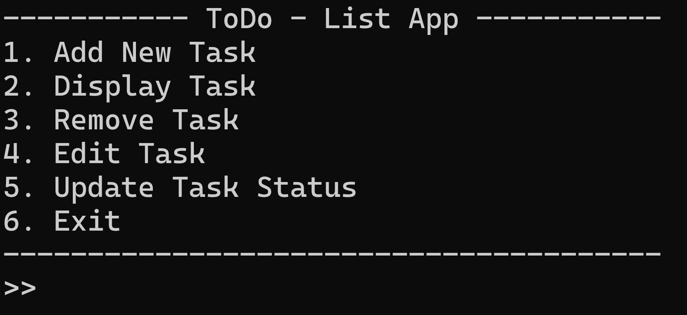

<!-- ABOUT THE PROJECT -->
## About The Project

This is a simple To-Do List Application developed in Java. The program helps users manage their tasks by offering functionalities to add, display, edit, remove, and update tasks. Each task includes a unique task ID, title, description, due date, and status (either "In Progress" or "Completed").



The application uses simple text-based input and is designed to run in a console.

### Built With

*](https://www.java.com/en/)


<!-- GETTING STARTED -->
## Getting Started

### Run Locally

1. Clone the repo
2. Install necessary packages
   ```sh
   pip install -r requirements.txt
   ```
4. Run streamlit_app.py 
   ```js
   streamlit run streamlit_app.py
   ```


<!-- USAGE EXAMPLES -->
## Usage


